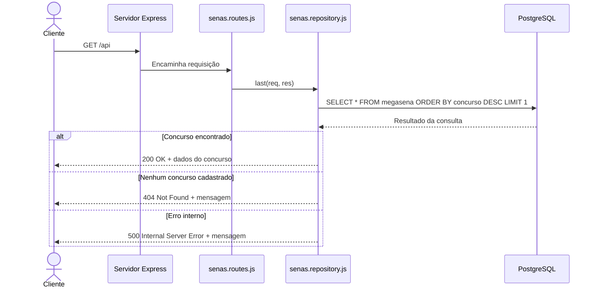
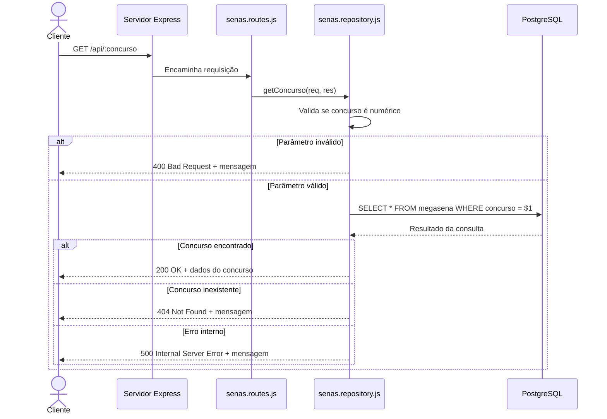

# 🍀 Mega-Sena API

Aplicação **Node.js + Express** para consulta de resultados de concursos da Mega-Sena. O projeto carrega os dados a partir de um arquivo CSV oficial em um banco **PostgreSQL** e os disponibiliza via API REST, consumida por uma interface web simples.

> 📌 Os dados foram obtidos na página oficial da CAIXA:
> [https://loterias.caixa.gov.br/Paginas/Mega-Sena.aspx](https://loterias.caixa.gov.br/Paginas/Mega-Sena.aspx)

---

## 🚀 Tecnologias

| Camada    | Tecnologia         |
| --------- | ------------------ |
| Runtime   | Node.js            |
| Framework | Express 5          |
| Banco     | PostgreSQL         |
| Driver    | node-postgres (pg) |
| Frontend  | HTML + CSS + JS    |
| Config    | dotenv             |

---

## 📁 Estrutura do Projeto

```
dev-web1-atv5/
├── public/
│   ├── assets/
│   │   └── js/
│   │       └── main.js          # Lógica do frontend (fetch + render)
│   └── pages/
│       └── index.html           # Página principal
├── src/
│   ├── database/
│   │   └── db.js                # Configuração do Pool de conexão (pg)
│   ├── infra/
│   │   ├── init/
│   │   │   ├── schema-sql.sql   # DDL - criação da tabela megasena
│   │   │   ├── seed-sql.sql     # Importação dos dados CSV
│   │   │   └── seed-data/       # Arquivo(s) CSV com os resultados
│   │   └── run-sql.js           # Script para inicializar o banco
│   ├── repositories/
│   │   └── senas.repository.js  # Queries SQL (last e getConcurso)
│   ├── routes/
│   │   └── senas.routes.js      # Rotas da API (/api e /api/:concurso)
│   └── server.js                # Entry point da aplicação
├── .env.example                 # Modelo de variáveis de ambiente
├── .gitignore
└── package.json
```

---

## ⚙️ Configuração

### 1. Clone o repositório e instale as dependências

```bash
git clone <url-do-repositorio>
cd dev-web1-atv5
npm install
```

### 2. Configure as variáveis de ambiente

Copie o arquivo de exemplo e ajuste com as suas credenciais PostgreSQL:

```bash
cp .env.example .env
```

```env
PORT=3000

POSTGRES_HOST=localhost
POSTGRES_PORT=5432
POSTGRES_USER=postgres
POSTGRES_PASSWORD=123
POSTGRES_DB=bdaula
```

### 3. Inicialize o banco de dados

Este comando cria a tabela `megasena` e importa os dados do CSV:

```bash
npm run db:init
```

---

## ▶️ Executando

**Modo desenvolvimento** (com hot-reload via `--watch`):

```bash
npm run dev
```

**Modo produção:**

```bash
npm start
```

A aplicação estará disponível em: `http://localhost:3000`

---

## 🌐 Rotas da API

Base path: `/api`

| Método | Rota             | Descrição                                 |
| ------ | ---------------- | ----------------------------------------- |
| `GET`  | `/api`           | Retorna o **último** concurso cadastrado  |
| `GET`  | `/api/:concurso` | Retorna um concurso pelo número informado |

### Exemplos de resposta

**`GET /api`** — Último concurso:

```json
{
  "concurso": 2700,
  "data_do_sorteio": "2024-05-11T00:00:00.000Z",
  "bola1": 3,
  "bola2": 7,
  "bola3": 18,
  "bola4": 29,
  "bola5": 44,
  "bola6": 57,
  "ganhadores_6_acertos": 0,
  "rateio_6_acertos": "0.00",
  "estimativa_premio": "75000000.00",
  ...
}
```

**`GET /api/1`** — Concurso específico:

```json
{
  "concurso": 1,
  "data_do_sorteio": "1996-03-11T00:00:00.000Z",
  "bola1": 41,
  "bola2": 05,
  "bola3": 04,
  "bola4": 52,
  "bola5": 30,
  "bola6": 33,
  ...
}
```

### Códigos de status

| Código | Situação                                      |
| ------ | --------------------------------------------- |
| `200`  | Concurso encontrado com sucesso               |
| `400`  | Parâmetro `:concurso` não é um número inteiro |
| `404`  | Concurso não encontrado no banco              |
| `500`  | Erro interno do servidor                      |

---

## 🗂️ Diagrama de Sequência

### `GET /api` — Último concurso



### `GET /api/:concurso` — Concurso por número



---

## 🗄️ Schema do Banco de Dados

Tabela: `public.megasena`

| Coluna                                      | Tipo           | Descrição                           |
| ------------------------------------------- | -------------- | ----------------------------------- |
| `concurso`                                  | `INTEGER`      | Número do concurso _(PK)_           |
| `data_do_sorteio`                           | `DATE`         | Data de realização                  |
| `bola1` … `bola6`                           | `INTEGER`      | Dezenas sorteadas                   |
| `ganhadores_6_acertos`                      | `INTEGER`      | Quantidade de ganhadores na faixa 6 |
| `cidade_uf`                                 | `VARCHAR(510)` | Cidade(s) dos ganhadores            |
| `rateio_6_acertos`                          | `DECIMAL`      | Prêmio por ganhador na faixa 6      |
| `ganhadores_5_acertos`                      | `INTEGER`      | Quantidade de ganhadores na faixa 5 |
| `rateio_5_acertos`                          | `DECIMAL`      | Prêmio por ganhador na faixa 5      |
| `ganhadores_4_acertos`                      | `INTEGER`      | Quantidade de ganhadores na faixa 4 |
| `rateio_4_acertos`                          | `DECIMAL`      | Prêmio por ganhador na faixa 4      |
| `acumulado_6_acertos`                       | `DECIMAL`      | Valor acumulado na faixa 6          |
| `arrecadacao_total`                         | `DECIMAL`      | Arrecadação total do concurso       |
| `estimativa_premio`                         | `DECIMAL`      | Estimativa do próximo prêmio        |
| `acumulado_sorteio_especial_mega_da_virada` | `DECIMAL`      | Acumulado da Mega da Virada         |
| `observacao`                                | `VARCHAR(255)` | Observações gerais                  |

---

## 📜 Scripts disponíveis

| Comando           | Descrição                                   |
| ----------------- | ------------------------------------------- |
| `npm start`       | Inicia o servidor em modo produção          |
| `npm run dev`     | Inicia com hot-reload (`node --watch`)      |
| `npm run db:init` | Executa o schema e seed no banco PostgreSQL |

---

## 📚 Contexto Acadêmico

Projeto desenvolvido como atividade da disciplina **Desenvolvimento Web I** — DSM 1º Período — FATEC.
